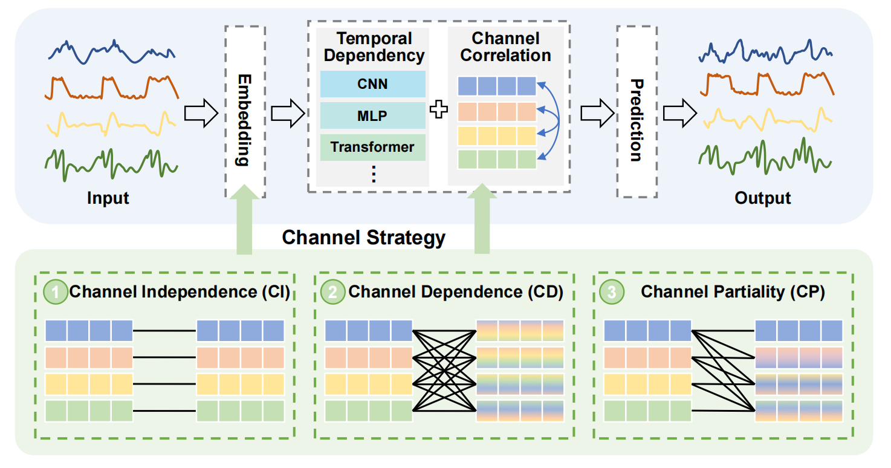

# **A Comprehensive Survey of Deep Learning for Multivariate Time Series Forecasting: A Channel Strategy Perspective**

  

- A channel strategy refers to the approach employed to process, integrate, or utilize information from multiple input channels.
- **Channel Independence (CI):** The CI strategy treats each channel independently, without considering any potential interactions or correlations among channels. Each channel is processed as a separate input, and no shared information or dependencies are utilized.
- **Channel Dependence (CD): **The CD strategy assumes that all channels in a multivariate time series are inherently correlated and interdependent, treating them as a unified entity during the forecasting process.
- **Channel Partiality (CP):**  The CP strategy strikes a balance between CI and CD, allowing each channel to retain a degree of independence while simultaneously interacting with other related channels. This approach emphasizes a hybrid state where channels selectively interact and exhibit partial correlations.

| Strategy | Mechanism         | Asym. | Lag. | Pol. | Gw.  | Dyn. | Ms.  | Method                                                       | Paradigm   | Venue | Year | Code                                                         |
| -------- | ----------------- | ----- | ---- | ---- | ---- | ---- | ---- | ------------------------------------------------------------ | ---------- | ----- | ---- | ------------------------------------------------------------ |
| **CI**   | -                 | -     | -    | -    | -    | -    | -    | [PatchTST](https://github.com/yuqinie98/patchtst)            | Specific   | ICLR  | 2023 | [Link](https://github.com/yuqinie98/patchtst)                |
| **CI**   | -                 | -     | -    | -    | -    | -    | -    | [CycleNet](https://github.com/ACAT-SCUT/CycleNet)            | Specific   | NIPS  | 2024 | [Link](https://github.com/ACAT-SCUT/CycleNet)                |
| **CI**   | -                 | -     | -    | -    | -    | -    | -    | [DLinear](https://github.com/cure-lab/LTSF-Linear)           | Specific   | AAAI  | 2023 | [Link](https://github.com/cure-lab/LTSF-Linear)              |
| **CI**   | -                 | -     | -    | -    | -    | -    | -    | [Timer](https://github.com/thuml/Large-Time-Series-Model)    | Foundation | ICML  | 2024 | [Link](https://github.com/thuml/Large-Time-Series-Model)     |
| **CI**   | -                 | -     | -    | -    | -    | -    | -    | [Chronos](https://github.com/amazon-science/chronos-forecasting) | Foundation | ICML  | 2024 | [Link](https://github.com/amazon-science/chronos-forecasting) |
| **CI**   | -                 | -     | -    | -    | -    | -    | -    | [LLM4TS](https://github.com/liaoyuhua/LLM4TS)                | Foundation | NIPS  | 2023 | [Link](https://github.com/liaoyuhua/LLM4TS)                  |
| **CI**   | -                 | -     | -    | -    | -    | -    | -    | [Time-LLM](https://github.com/KimMeen/Time-LLM)              | Foundation | ICLR  | 2024 | [Link](https://github.com/KimMeen/Time-LLM)                  |
| **CI**   | -                 | -     | -    | -    | -    | -    | -    | [RevIN](https://github.com/ts-kim/RevIN)                     | Plugin     | ICLR  | 2021 | [Link](https://github.com/ts-kim/RevIN)                      |
| **CD**   | CNN-based         | ✓     | -    | -    | -    | -    | -    | [Informer](https://github.com/zhouhaoyi/Informer2020)        | Specific   | AAAI  | 2021 | [Link](https://github.com/zhouhaoyi/Informer2020)            |
| **CD**   | CNN-based         | ✓     | -    | -    | -    | -    | -    | [Autoformer](https://github.com/thuml/Autoformer)            | Specific   | NIPS  | 2021 | [Link](https://github.com/thuml/Autoformer)                  |
| **CD**   | CNN-based         | ✓     | -    | -    | -    | -    | -    | [FEDformer](https://github.com/MAZiqing/FEDformer)           | Specific   | ICML  | 2022 | [Link](https://github.com/MAZiqing/FEDformer)                |
| **CD**   | CNN-based         | ✓     | -    | -    | -    | -    | -    | [TimesNet](https://github.com/thuml/TimesNet)                | Specific   | ICLR  | 2023 | [Link](https://github.com/thuml/TimesNet)                    |
| **CD**   | MLP-based         | ✓     | -    | -    | -    | -    | -    | [TSMixer](https://github.com/ditschuk/pytorch-tsmixer)       | Specific   | KDD   | 2023 | [Link](https://github.com/ditschuk/pytorch-tsmixer)          |
| **CD**   | MLP-based         | ✓     | -    | -    | -    | -    | -    | [TTM](https://github.com/ibm-granite/granite-tsfm)           | Foundation | NIPS  | 2024 | [Link](https://github.com/ibm-granite/granite-tsfm)          |
| **CD**   | Transformer-based | ✓     | -    | -    | -    | ✓    | -    | [iTransformer](https://github.com/thuml/iTransformer)        | Specific   | ICLR  | 2024 | [Link](https://github.com/thuml/iTransformer)                |
| **CD**   | Transformer-based | ✓     | -    | -    | -    | ✓    | -    | [Crossformer](https://github.com/Thinklab-SJTU/Crossformer)  | Specific   | ICLR  | 2023 | [Link](https://github.com/Thinklab-SJTU/Crossformer)         |
| **CD**   | Transformer-based | ✓     | ✓    | -    | -    | -    | -    | [VCformer](https://github.com/CSyyn/VCformer)                | Specific   | IJCAI | 2024 | [Link](https://github.com/CSyyn/VCformer)                    |
| **CD**   | Transformer-based | ✓     | ✓    | -    | -    | ✓    | -    | [MOIRAI](https://github.com/SalesforceAIResearch/uni2ts)     | Foundation | ICML  | 2024 | [Link](https://github.com/SalesforceAIResearch/uni2ts)       |
| **CD**   | Transformer-based | ✓     | -    | -    | -    | ✓    | -    | [UniTS](https://github.com/mims-harvard/UniTS)               | Foundation | NIPS  | 2024 | [Link](https://github.com/mims-harvard/UniTS)                |
| **CD**   | GNN-based         | -     | -    | -    | -    | ✓    | -    | [GTS](https://github.com/chaoshangcs/GTS)                    | Specific   | ICLR  | 2021 | [Link](https://github.com/chaoshangcs/GTS)                   |
| **CD**   | GNN-based         | ✓     | -    | -    | -    | -    | ✓    | [MSGNet](https://github.com/YoZhibo/MSGNet)                  | Specific   | AAAI  | 2024 | [Link](https://github.com/YoZhibo/MSGNet)                    |
| **CD**   | GNN-based         | -     | ✓    | -    | -    | -    | -    | [FourierGNN](https://github.com/aikunyi/FourierGNN)          | Specific   | NIPS  | 2023 | [Link](https://github.com/aikunyi/FourierGNN)                |
| **CD**   | GNN-based         | -     | ✓    | -    | -    | -    | -    | [FC-STGNN](https://github.com/Frank-Wang-oss/FCSTGNN)        | Specific   | AAAI  | 2024 | [Link](https://github.com/Frank-Wang-oss/FCSTGNN)            |
| **CD**   | GNN-based         | ✓     | -    | -    | -    | ✓    | -    | [TPGNN](https://github.com/zyplanet/TPGNN)                   | Specific   | NIPS  | 2022 | [Link](https://github.com/zyplanet/TPGNN)                    |
| **CD**   | GNN-based         | ✓     | -    | -    | -    | ✓    | ✓    | [ESG](https://github.com/LiuZH-19/ESG)                       | Specific   | KDD   | 2022 | [Link](https://github.com/LiuZH-19/ESG)                      |
| **CD**   | GNN-based         | ✓     | -    | -    | -    | ✓    | ✓    | [EnhanceNet](https://github.com/razvanc92/EnhanceNet)        | Plugin     | ICDE  | 2021 | [Link](https://github.com/razvanc92/EnhanceNet)              |
| **CD**   | Others            | ✓     | ✓    | -    | -    | -    | -    | [SOFTS](https://github.com/Secilia-Cxy/SOFTS)                | Specific   | NIPS  | 2024 | [Link](https://github.com/Secilia-Cxy/SOFTS)                 |
| **CD**   | Others            | ✓     | -    | -    | ✓    | -    | -    | [C-LoRA](https://github.com/tongnie/C-LoRA)                  | Plugin     | CIKM  | 2024 | [Link](https://github.com/tongnie/C-LoRA)                    |
| **CP**   | CNN-based         | ✓     | -    | -    | -    | -    | -    | [ModernTCN](https://github.com/luodhhh/ModernTCN)            | Specific   | ICLR  | 2024 | [Link](https://github.com/luodhhh/ModernTCN)                 |
| **CP**   | Transformer-based | ✓     | -    | -    | ✓    | -    | -    | [DUET](https://github.com/decisionintelligence/DUET)         | Specific   | KDD   | 2025 | [Link](https://github.com/decisionintelligence/DUET)         |
| **CP**   | Transformer-based | ✓     | -    | -    | -    | ✓    | -    | [MCformer](https://github.com/IITJMCformer)                  | Specific   | IITJ* | 2024 | -                                                            |
| **CP**   | Transformer-based | ✓     | -    | -    | ✓    | ✓    | -    | [DGCformer](https://github.com/liu2024dgcformer)             | Specific   | arXiv | 2024 | -                                                            |
| **CP**   | Transformer-based | -     | -    | -    | -    | ✓    | -    | [CM](https://github.com/lee2024partial)                      | Plugin     | NIPS  | 2024 | -                                                            |
| **CP**   | GNN-based         | ✓     | -    | -    | -    | ✓    | -    | [MTGNN](https://github.com/nnzhan/MTGNN)                     | Specific   | KDD   | 2020 | [Link](https://github.com/nnzhan/MTGNN)                      |
| **CP**   | GNN-based         | ✓     | -    | -    | ✓    | -    | -    | [CrossGNN](https://github.com/hqh0728/CrossGNN)              | Specific   | NIPS  | 2023 | [Link](https://github.com/hqh0728/CrossGNN)                  |
| **CP**   | GNN-based         | ✓     | -    | -    | -    | ✓    | -    | [WaveForM](https://github.com/alanyoungCN/WaveForM)          | Specific   | AAAI  | 2023 | [Link](https://github.com/alanyoungCN/WaveForM)              |
| **CP**   | GNN-based         | -     | -    | -    | -    | ✓    | -    | [MTSF-DG](https://github.com/decisionintelligence/MTSF-DG)   | Specific   | VLDB  | 2023 | [Link](https://github.com/decisionintelligence/MTSF-DG)      |
| **CP**   | GNN-based         | ✓     | -    | -    | ✓    | ✓    | ✓    | [ReMo](https://github.com/ReMo)                              | Specific   | IJCAI | 2023 | -                                                            |
| **CP**   | GNN-based         | ✓     | -    | -    | -    | ✓    | ✓    | [Ada-MSHyper](https://github.com/shangzongjiang/Ada-MSHyper) | Specific   | NIPS  | 2024 | [Link](https://github.com/shangzongjiang/Ada-MSHyper)        |
| **CP**   | Others            | ✓     | ✓    | -    | -    | ✓    | -    | [LIFT](https://github.com/SJTU-DMTai/LIFT)                   | Plugin     | ICLR  | 2024 | [Link](https://github.com/SJTU-DMTai/LIFT)                   |
| **CP**   | Others            | ✓     | -    | -    | ✓    | -    | -    | [CCM](https://github.com/Graph-and-Geometric-Learning/TimeSeriesCCM) | Plugin     | NIPS  | 2024 | [Link](https://github.com/Graph-and-Geometric-Learning/TimeSeriesCCM) |

